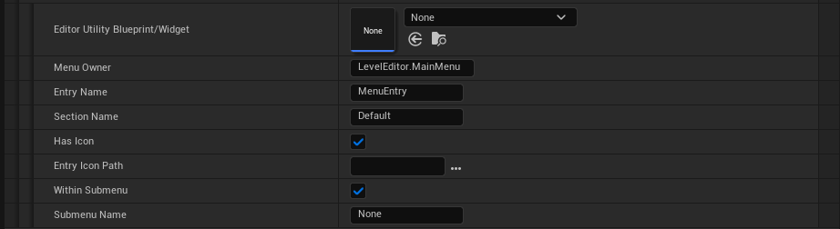

# Editor Utility Extension Plugin 
# Customizing the Unreal Editor
All the editor customization features in the plugin are managed by the ToolMenus extension, the primary module for creating custom toolbars and menus in the Unreal Editor.

You can access all the Toolmenus handlers by running a console command, which is already added in the plugin settings for convenience.

```Toolmenus.Edit``` By running this command, you will access all the toolmenu handlers 


## Features Overview
- Custom Toolbar Button to Invoke a New Editor Tab from an Editor Utility Widget
  - Ability to Call the Run Function from an Editor Utility Blueprint (AssetAction or ActorAction)
- Custom Menu in the Main Menu
  - Add a custom menu entry to any menu, This menu can provide shortcuts to tools, utilities, and other features (e.g. Actor Context Menu, Asset Context Menu, Place Actor and so on)
- Class Icon and Thumbnails
  - Assign custom icons or thumbnails to classes, improving the visual representation of assets in the content browser.
  - Assign custom thumbnails for Blueprints and DataAssets by Calling an Interface
- Custom UMG Controls for Editor Utility Widgets
  - Splitter
  - Editor Tab Control

# Add Custom Toolbar Button

Add a custom button to the toolbar that will invoke an Editor Tab, displaying an Editor Utility Widget (EUW). This allows custom widgets to appear in the editor, extending functionality directly within the editor's interface.

- Add a button element to the Custom Toolbar Button Array
  - Use Custom Toolbar Owner
    - By default, a new toolbar menu will be added to the main editor toolbar. If you want to add a custom toolbar button to another toolbar, such as the Sequencer toolbar, you need to enable this option and enter the toolbar owner handler that you found using the ToolMenus command.
    - Toolbar Owner
      - Toolbar Handler (e.g. ```LevelEditor.LevelEditorToolbar.User```)
    - Section Name
  - Icon Path
    - Assing an icon for the toolbar button (```svg``` or ```png```)
  - Button Name
  - Editor Utility Blueprint/Widget
    - Assign a Editor Utility Widget(EUW) to be spawned as a new editor tab
    - Assign a Editor Utility Blueprint(```AssetActionUtility```/```ActorActionUtility```)
    - It required to have a ```Run``` function


# Add Custom Menu

Add a new custom menu to Unreal Engine's main menu. This menu can provide shortcuts to tools, utilities, or other features of the plugin.

- Add a button element to the Custom Editor Menus array
    - Editor Utility Blueprint/Widget
    - Assign a Editor Utility Widget(EUW) to be spawned as a new editor tab
    - Assign a Editor Utility Blueprint (```AssetActionUtility```/```ActorActionUtility```)
    - It required to have a ```Run``` function
  - Menu Owner
    - It is the menu owner handler that by default is defined to be added into the MainMenu (```LevelEditor.MainMenu```)
  - Entry Name
  - Section Name
    - You can define a custom section name, or get access to existing ones from the ToolMenu command.
  - Has Icon (If you want to add an icon for the menu entry enable this option)
    - Entry Icon Path
      - Assing an icon for the toolbar button (```svg``` or ```png```)
  - Within Submenu (if you want to have the menu item to be under a submenu)
  - Submenu Name




## Example

Adding a custom option to the Add Quick Menu 
- Run the Enable ToolMenus button on the setting
- Grab the  Add Quick Menu's toolmenus handler
- Add a Custom Menu Entry and fill in the parameters

 
 
 

# Custom Class Icon & Thumbnails

Assign custom icons or thumbnails to classes, improving the visual representation of assets in the content browser.

*This feature doesn't work for Blueprint and you have to use the Interface approach*

- Add an element to the Custom Class Icons array
    - Class Icons
      - Enable it to customize the class's icon
    - Icon Path
      - You can assign custom files as thumbnails/icons for your custom classes.(```svg``` or ```png```)
    - Class Thumbnail
      - Enable it to customize the class's thumbnail
    - Class
      - Choose a class which you want to customize it's Icon and Thumbnail


# Custom Thumbnails for Blueprints and DataAssets

Generate custom thumbnails for Blueprints or DataAssets based on internal data retrieved via an interface.
- Add interface into your base class and implement ```Get Thumbnail Info```
- Set the background color
- Set the custom image
  - You can customize the thumbnail based on the internal data and asyncload the thumbnail image.


# Custom Editor Widget Controls

## EditorTabControl

Tab Control is a wrapper for ```SSegmentedControl``` for UMG editor, It is functionally similar to a group of Radio Buttons, which after select one of them, it returns the index of the current selected tab. and you can switch between contents by using a ```WidgetSwitcher```

- You can add a list of Tab buttons
  - **Button Text**
  - **Tooltip**
  - **IconType**
    - **None**, A tab without any icons
    - **EditorStyle**, Get an EditorStyle icon (you can find them from the Editor Styles in Source code, (e.g. ```Icons.Play``` is a default icon style for the play button)
    - **Custom Brush**, Assing a custom brush from an image


## SplitterBox

SplitterBox divides its allotted area into N segments, where N is the number of children it has. It allows the users to resize the children along the splitter axis: that is, horizontally or vertically. It is a wrapper for SSplitter for UMG Editor.
- Orientation
  - Horizontal
  - Vertical
- Resize Mode
  - **FixedPosition**, Resize the selected slot. If space is needed, then resize the next resizable slot.
  - **FixedSize**, Resize the selected slot. If space is needed, then resize the last resizable slot.
  - **Fill**, Resize the selected slot by redistributing the available space with the following resizable slots.
  


### SplitterSlot
Each child is a slot for the Splitter
- **Size Rule**
  - **SizeToContent**, Get the desired size of the content
  - **FractionOfParent**, Use a fraction of the parent's size
- **Min Size**, The minimum size of the slot
- **Value**, The percentage amount of the slot to cover the splitter area (if the size rule is set to **FractionOfParent**)
- **Resizable**, Enable the splitter content to be resizable.
  


